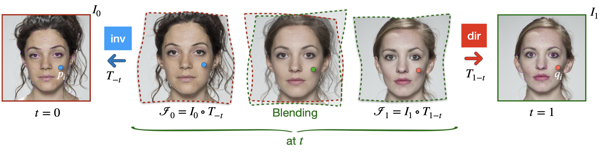

# Neural Implicit Morphing of Face Images
[Guilherme Schardong [1]](https://schardong.github.io/),
[Tiago Novello [2]](https://sites.google.com/site/tiagonovellodebrito),
[Hallison Paz [2]](https://hallisonpaz.com.br/)
[Iurii Medvedev [1]](https://visteam.isr.uc.pt/team/iurii-medvedev)
[Vinícius da Silva [3]](https://dsilvavinicius.github.io/),
[Luiz Velho [2]](https://lvelho.impa.br/)
[Nuno Gonçalves [1,4]](https://home.deec.uc.pt/~nunogon/)
<br>
[1] Institute of Systems and Robotics, University of Coimbra (UC)
<br>
[2] Institute for Pure and Applied Mathematics (IMPA),
<br>
[3] Pontifical Catholic University of Rio de Janeiro (PUC-Rio),
<br>
[4] Portuguese Mint and Official Printing Office (INCM),

This is the official implementation of "Neural Implicit Morphing of Face Images", published on the [Proceedings of CVPR 2024](https://openaccess.thecvf.com/content/CVPR2024/html/Schardong_Neural_Implicit_Morphing_of_Face_Images_CVPR_2024_paper.html), also on [arXiv](https://arxiv.org/abs/2308.13888).



## Getting started

**TL-DR**: If you just want to run the code, follow the steps below (assuming a UNIX system with Make installed). For more details, jump to `Setup and sample run` section.

```{sh}
python -m venv .venv
source .venv/bin/activate
pip install -r requirements.txt
pip install -e .
make data/frll_neutral_front
python mark-warp-points.py --landmark_detector dlib --output experiments/001_002.yaml data/frll_neutral_front/001_03.jpg data/frll_neutral_front/002_03.jpg
python warp-train.py --no-ui experiments/001_002.yaml
```

### Prerequisites
1. [Python venv](https://docs.python.org/3/library/venv.html), or [Anaconda](https://www.anaconda.com/products/individual#Downloads), alternativelly you can use [PyEnv](https://github.com/pyenv/pyenv) and [PyEnv-VirtualEnv](https://github.com/pyenv/pyenv-virtualenv) or other environment management mechanism
2. [Git](https://git-scm.com/download)
3. [Integrate Git Bash with conda](https://discuss.codecademy.com/t/setting-up-conda-in-git-bash/534473) (If on Windows)

### Code organization
Most of the functions are available through the `ifmorph` module. It contains the following files:
* `dataset.py` - dataset and sampling classes
* `diff_operators.py` - implementation of differential operators (gradient, hessian, jacobian, curvatures)
* `loss_functions.py` - contains loss functions for different experimental settings
* `model.py` - network and layer definitions
* `point_editor.py` - user interface for editing landmarks
* `util.py` - miscellaneous functions

On the repository root, we stored most of the scripts needed to reproduce our work for general face images. We list them below for completeness:
* `mark-warp-points.py` - marks the landmark points for warping. Optionally, allows their editing via a simple UI
* `warp-inference-image.py` - runs the inference of a pretrained face warping network, outputs an image, or series of images
* `warp-inference-vid.py` - runs the inference of a pretrained face warping network, outputs a video
* `warp-train.py` - trains a warping network for face landmark warping between two continuous or discrete initial states

Inside the `standalone` folder, we've stored scripts used for experiments in our paper, mainly the metrics (FID and LPIPS), alignment and, landmark detection. These are:
* `align.py` - crop/resize/alignment script for the face images
* `create-initial-states.py` - trains the networks that encode the initial states (faces) may be used for warping as well
* `create-experiment-files.py` - given a list of morphing pairs, image paths and landmarks, creates the corresponding experiment files
* `calc-fid.sh` - calculates the Fréchet Inception Distance (FID) between two sets of images
* `calc-lpips.py` - calculates the LPIPS between pairs of images
* `detect-landmarks.py` - given a list of images, detects the facial landmarks using DLib and stores them as `.DAT` files

### Setup and sample run
For this setup, we assume that the Python version is >= 3.10.0 and CUDA Toolkit is 11.6. We also tested with Python 3.9.0 and CUDA 11.7 everything worked as well. Note that **we assume that all commands are typed in the root of the repository**, unless stated otherwise. **Note that we tested these steps only on Ubuntu 22.04.**

(Optional) After cloning the repository, issue a `git submodule init` followed by `git submodule update` command on a terminal, to download the `mrimg` submodule.

#### venv
Using Python's [venv](https://docs.python.org/3/library/venv.html) is the simplest option, as it involves no addons other than a functioning Python installation. Simply open a terminal, navigate to the repository root and type the following commands:
```{sh}
python -m venv .venv
source .venv/bin/activate
pip install -r requirements.txt
pip install -e .
```

#### PyEnv
First, you need to have both [PyEnv](https://github.com/pyenv/pyenv) and [PyEnv-virtualenv](https://github.com/pyenv/pyenv-virtualenv) installed. Afterwards, just type the following commands in a terminal.
```{sh}
pyenv virtualenv 3.10.0 ifmorph
pyenv local ifmorph
pip install -r requirements.txt
pip install torch torchvision --extra-index-url https://download.pytorch.org/whl/nightly/cu116
pip install -e .
```

#### Conda
For convenience, we provide an `environment_${SYSTEM}.yml` file with our environment configuration, where `${SYSTEM}`is either `ubuntu` or `windows`. To create an environment from this file, just type the following commands in a terminal (replace `${SYSTEM}` for either `ubuntu` or `windows`).
```{sh}
conda env create -f environment_${SYSTEM}.yml
conda activate ifmorph
pip install -e .
```

If you prefer to create an environment from scratch, the following commands may be used instead. Note that this is a suggestion, you may customize names and versions to suit your needs.
```{sh}
conda create --name ifmorph
conda activate ifmorph
conda install pytorch torchvision pytorch-cuda=11.6 -c pytorch -c nvidia
pip install -r requirements.txt
pip install -e .
```

#### Dataset
Download the [Face Research Lab London](https://figshare.com/articles/dataset/Face_Research_Lab_London_Set/5047666) dataset from their website. If you use makefiles, we provide a rule to download and extract the dataset to the correct location (see the `Makefile`, rule `data/frll_neutral_front`). Any image may be used, as long as it contains a face. Optionally, you may create an implicit representation by running the `create-initial-states.py` script (an example is provided below).

An optional pre-processing step is implemented in a modified version of the `align.py` script, provided by the [DiffAE](https://github.com/phizaz/diffae) authors (which they extracted from the FFHQ pre-processing script) to crop and resize the images. We modified it to allow for a "non-alignment", thus the images are cropped and resized, but not necessarilly aligned. For the quantitative comparisons, the images need to be pre-processed by the `align.py` script, since the other models assume the face to occupy a central (and large) part of the image.

#### How to run
0. (Optional) Crop/resize the images
1. (Optional) Create the initial neural implicit representation of your target images (note that wildcards are accepted)
2. Create the face landmarks manually ou automatically
3. Run the warp training script

In an Ubuntu 22.04 system, the commands below should do it. Note that the optional parameters have default values, thus you don't need to specify them. We do it here for some of them to demonstrate possible values:

```{sh}
(OPTIONAL) python align.py --just-crop --output-size 1024 --n-tasks 4 data/frll/ data/frll_neutral_front_cropped
(OPTIONAL) python create-initial-states.py --nsteps 1000 --device cuda:0 experiments/initial_state_rgb_large_im.yaml data/frll_neutral_front/001_03.jpg data/frll_neutral_front/002_03.jpg
python mark-warp-points.py data/frll_neutral_front/001_03.jpg data/frll_neutral_front/002_03.jpg
python warp-train.py experiments/001_002-baseline.yaml
```

Additionally, we provide a `Makefile` with the source code, that trains the initial states (or downloads them from [here](https://drive.google.com/file/d/1QYoprK2bycXHItSkx9H8JfMGz48B9a3N/view?usp=sharing) or [here](https://drive.google.com/file/d/1guMg5ablWDQgaSfr5sFwScPWa-gm5Vsz/view?usp=sharing) if you want the cropped images) and runs the example warping experiment.

### Reproducing the paper's experiments
To avoid cluttering the repository, we've opted to store the experiment configuration files externally. You can generate them after following the *Setup* procedure above. For convenience, you can download the experiment files from [here](https://drive.google.com/file/d/1S1J_lsuGxPeU3DMOJMinXSjHGi91m9Ru/view?usp=sharing) and pretrained image networks from [here](https://drive.google.com/file/d/1QYoprK2bycXHItSkx9H8JfMGz48B9a3N/view?usp=sharing). Also, see the **Makefile** for rules that automate this process. However, we describe the steps to recreate those files below. We always assume that the commands are typed from the repository root. Additionally, we assume that the python environment is activated. First, you must crop and resize the FRLL face images, afterwards you must create the neural initial states. You can do so by typing:

```{sh}
python standalone/align.py --just-crop --output-size 1350 --n-tasks 4 data/frll_neutral_front/ data/frll_neutral_front_cropped
python standalone/create-initial-states.py --nsteps 5000 --device cuda:0 --output_path pretrained/frll_neutral_front_cropped experiments/initial_state_rgb_large_im.yaml data/frll_neutral_front_cropped/*.png
```

Note that `data/frll_neutral_front_cropped` is not in the repository as well. You can download the original images from the FRLL repository (see our **Makefile**) and crop them using the first command above.
This will store all images in `data/frll_neutral_front_cropped` in the `pretrained/frll_neutral_front_croppped` folder. Afterwards, run the script to detect the landmarks, followed by the script to create the experiment configuration files:

```{sh}
python standalone/detect-landmarks.py -o pretrained/frll_neutral_front_cropped/ pretrained/frll_neutral_front_cropped/*.pth
python standalone/create-experiment-files.py data/pairs_for_morphing_full.txt pretrained/frll_neutral_front_cropped/ experiments/pairwise_dlib
```

Finally, you can simply train the warpings by issuing the following command:

```{sh}
python warp-train.py experiments/pairwise_dlib/*.yaml --no-ui --logging none --device cuda:0 --output-dir results/pairwise_dlib --skip-finished --no-reconstruction
```

The above command will run the trainings sequentially. However, if you may notice that your GPU is underutilized. In this case, you may run the `warp-train.py` script setting the `--n-tasks` parameter to any value larger than 1, as shown below. In this case, it will run multiple trainings in parallel *in the same GPU*. Tweak `--n-tasks` accordingly.

```{sh}
python warp-train.py experiments/pairwise_dlib/*.yaml --no-ui --logging none --device cuda:0 --output-path results/pairwise_dlib --n-tasks 6 --skip-finished --no-reconstruction
```

## Contributing
Any contribution is welcome. If you spot an error or have questions, open issues and we will answer as soon as possible.

## Citation
If you find our work useful in your research, consider citing it in your tech report or paper.

```{bibtex}
@InProceedings{Schardong_2024_CVPR,
    author    = {Schardong, Guilherme and Novello, Tiago and Paz, Hallison and Medvedev, Iurii and da Silva, Vin{\'\i}cius and Velho, Luiz and Gon\c{c}alves, Nuno},
    title     = {Neural Implicit Morphing of Face Images},
    booktitle = {Proceedings of the IEEE/CVF Conference on Computer Vision and Pattern Recognition (CVPR)},
    month     = {June},
    year      = {2024},
    pages     = {7321-7330}
}
```
